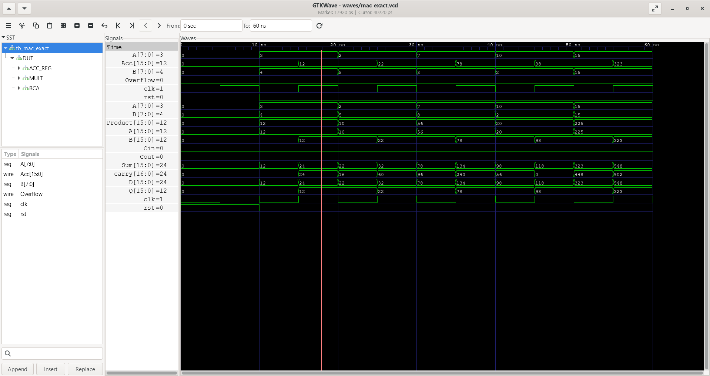
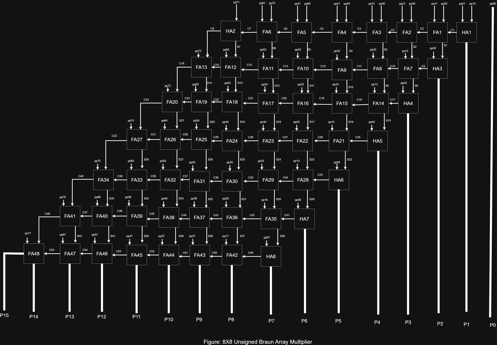
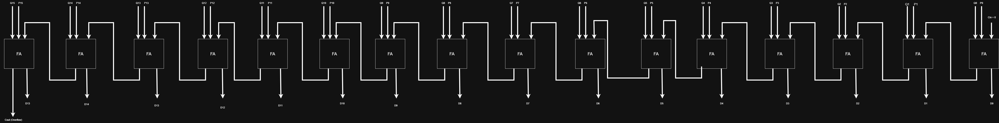
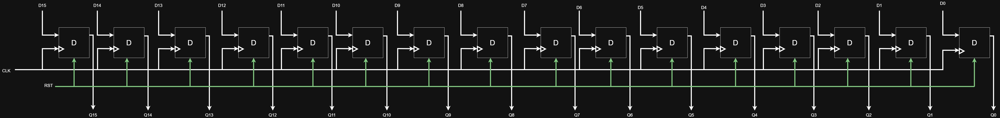

# Exact 8×8 Multiply-Accumulate (MAC)

A hierarchical RTL implementation of an **Exact 8×8 Multiply-Accumulate (MAC)** designed in **SystemVerilog**. The architecture is built from fundamental combinational and sequential building blocks, with each module individually verified using dedicated SystemVerilog testbenches.

The design was simulated using **Icarus Verilog** and functionally verified with **GTKWave**.

---

## Architecture


## Simulation Waveform



## Architecture

The Exact MAC integrates three major hardware modules:

- **8×8 Braun Multiplier**
- **16-bit Ripple Carry Adder**
- **16-bit Register (Accumulator)**

The accumulator stores the previous result and feeds it back to the adder, implementing the Multiply-Accumulate operation:

ACC(new) = ACC(old) + (A × B)

---

## Design Hierarchy

```
Exact MAC
│
├── 8×8 Braun Multiplier
│   ├── Partial Product Generator
│   ├── Half Adders
│   └── Full Adders
│
├── 16-bit Ripple Carry Adder
│   └── Full Adders
│
└── 16-bit Register
    └── D Flip-Flops
```

---

## Repository Structure

```
EXACT_MAC/
│
├── images/
│   ├── 4X4 Braun_multiplier.jpg
│   ├── 8X8 Braun_Multiplier.jpg
│   ├── 16_RCA.jpg
│   ├── 16-bit-register-D_FF.jpg
│   ├── Exact_MAC.jpg
│   └── Exact MAC waveform.png
│
├── rtl/
│   ├── half_adder.sv
│   ├── full_adder.sv
│   ├── partial_product_generator.sv
│   ├── braun_multiplier_4x4.sv
│   ├── braun_multiplier_8x8.sv
│   ├── d_flip_flop.sv
│   ├── register_16.sv
│   ├── ripple_adder.sv
│   ├── ripple_adder_16.sv
│   └── mac_exact.sv
│
├── tb/
│   ├── tb_half_adder.sv
│   ├── tb_full_adder.sv
│   ├── tb_partial_product_generator.sv
│   ├── tb_braun_multiplier_4x4.sv
│   ├── tb_braun_multiplier_8x8.sv
│   ├── tb_d_flip_flop.sv
│   ├── tb_register_16.sv
│   ├── tb_ripple_adder.sv
│   ├── tb_ripple_adder_16.sv
│   └── tb_mac_exact.sv
│
├── sim/
│   └── *.out
│
├── waves/
│   └── *.vcd
│
└── README.md
```

---

## Module Description

### 8×8 Braun Multiplier

The 8×8 Braun Multiplier is an array multiplier that computes the product of two unsigned 8-bit operands. It consists of three stages:

1. **Partial Product Generation** – Each partial product is generated using a 2-input AND gate:

```
pp[i][j] = A[i] & B[j]
```
2. **Partial Product Reduction** – The partial products are reduced using a network of Half Adders and Full Adders arranged in the Braun array architecture.
3. **Product Generation** – The reduced sums and carries produce the final 16-bit product.

For architectural clarity, the multiplier hierarchy is expanded in the accompanying block diagram, illustrating the partial product generator, Half Adders, and Full Adders that form the complete 8×8 Braun Multiplier.




---

### 16-bit Ripple Carry Adder

Adds:

- 16-bit Product
- 16-bit Accumulator

Produces:

- 16-bit Sum
- Carry-Out (Overflow)



---

### 16-bit Register (Accumulator)

- Built using sixteen positive-edge-triggered D Flip-Flops.
- Stores the accumulated result.
- Reset initializes the accumulator to zero.



---

## Top-Level Interface

| Signal | Width | Description |
|---------|------:|-------------|
| clk | 1 | Clock |
| rst | 1 | Asynchronous Reset |
| A | 8 | Multiplicand |
| B | 8 | Multiplier |
| Acc | 16 | Accumulator Output |
| Overflow | 1 | Carry-Out from the 16-bit Adder |

---

## Functional Verification

Each module was verified independently before integration.

Verified Modules:

-  Half Adder
-  Full Adder
-  D Flip-Flop
-  16-bit Register
-  16-bit Ripple Carry Adder
-  8×8 Braun Multiplier
-  Exact MAC

---

## Example Simulation

| Clock Cycle | A | B | Product | Accumulator |
|------------:|--:|--:|--------:|------------:|
| Reset | - | - | - | 0 |
| 1 | 3 | 4 | 12 | 12 |
| 2 | 2 | 5 | 10 | 22 |
| 3 | 7 | 8 | 56 | 78 |
| 4 | 10 | 2 | 20 | 98 |
| 5 | 15 | 15 | 225 | 323 |

---

## Development Workflow

The project was developed following the workflow below:

```text
Architecture Design (draw.io)
          │
          ▼
RTL Implementation (SystemVerilog)
          │
          ▼
Compilation & Simulation (Icarus Verilog)
          │
          ▼
Functional Verification (SystemVerilog Testbenches)
          │
          ▼
Waveform Analysis (GTKWave)
          │
          ▼
Version Control (Git/GitHub)
```

## Simulation Flow

```
SystemVerilog RTL
        │
        ▼
Icarus Verilog
        │
        ▼
VVP Simulation
        │
        ▼
GTKWave
```

---

## Build

Compile:

```bash
iverilog -g2012 -o sim/mac_exact.out \
rtl/full_adder.sv \
rtl/half_adder.sv \
rtl/d_flip_flop.sv \
rtl/register_16.sv \
rtl/ripple_adder_16.sv \
rtl/braun_multiplier_8x8.sv \
rtl/mac_exact.sv \
tb/tb_mac_exact.sv
```

Run:

```bash
vvp sim/mac_exact.out
```

Open Waveform:

```bash
gtkwave waves/mac_exact.vcd
```

---

## Tools

- SystemVerilog
- OSS CAD Suite
- Icarus Verilog
- GTKWave
- draw.io  (Architecture Diagrams)
  

---

## Results

The Exact MAC successfully performs sequential multiply-accumulate operations, with simulation confirming correct accumulation across clock cycles.

Example accumulator progression:

```
0 → 12 → 22 → 78 → 98 → 323
```

---

## Author

**Yash Kumar**

Electronics & Communication Engineering

- LinkedIn: https://www.linkedin.com/in/yash-kumar-678b8930b/
- GitHub: https://github.com/gjgj7676
